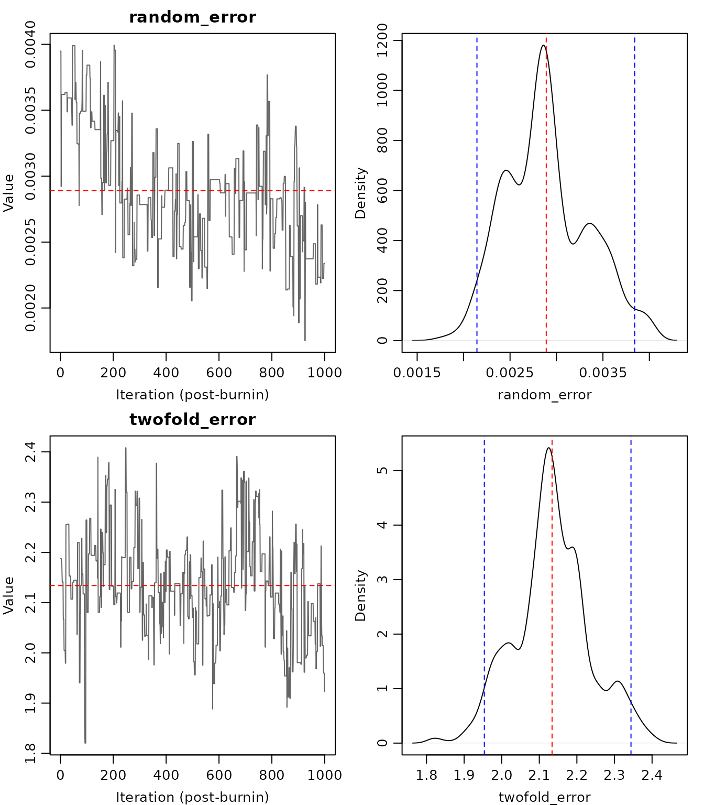
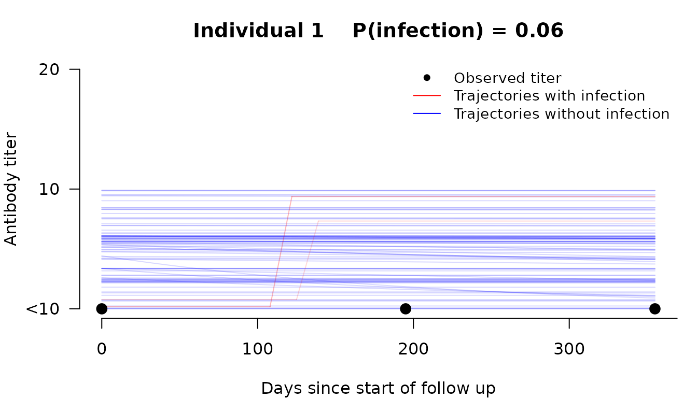
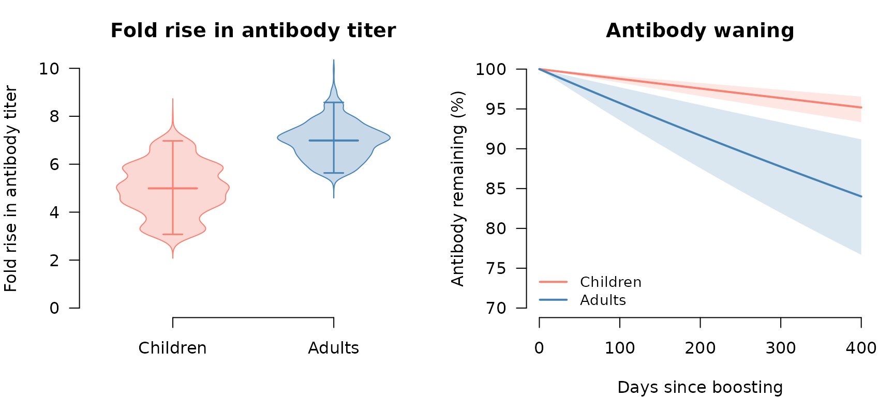

# Getting Started with seroreconstruct

## Overview

`seroreconstruct` is an R package for Bayesian inference of influenza
virus infection status from serial antibody measurements. It relaxes the
traditional 4-fold rise rule by jointly modeling antibody boosting after
infection, waning over time, and measurement error — estimating
individual-level infection probabilities from hemagglutination
inhibition (HAI) titer data.

The statistical framework is described in [Tsang et al. (2022) *Nature
Communications* 13:1557](https://doi.org/10.1038/s41467-022-29310-8).

## Input data

The package requires two data frames:

1.  **`inputdata`** — one row per individual with columns:
    - `age_group`: integer (0 = children, 1 = adults, 2 = older adults)
    - `start_time`, `end_time`: follow-up period (integer days)
    - `time1`, `time2`, `time3`: serum collection dates (integer days)
    - `HAI_titer_1`, `HAI_titer_2`, `HAI_titer3`: HAI titers at each
      collection
2.  **`inputILI`** — daily influenza-like illness activity, with rows
    corresponding to consecutive days. The row indices must cover the
    range of `start_time` to `end_time` in `inputdata`.

``` r
library(seroreconstruct)

data("inputdata")
data("flu_activity")

head(inputdata)
#>   age_group start_time end_time time1 time2 time3 HAI_titer_1 HAI_titer_2
#> 1         0        837     1192   837  1032  1192           0           0
#> 2         2        837     1192   837  1032  1192           0           0
#> 3         2        837     1192   837  1032  1192           0           0
#> 4         0        837     1192   837  1032  1192           4           4
#> 5         0        845     1191   845  1034  1191           0           0
#> 6         2        845     1191   845  1034  1191           0           0
#>   HAI_titer3
#> 1          0
#> 2          0
#> 3          0
#> 4          4
#> 5          0
#> 6          0
dim(inputdata)
#> [1] 1753    9
```

## Fitting the model

The main function
[`sero_reconstruct()`](https://timktsang.github.io/seroreconstruct/reference/sero_reconstruct.md)
runs a Bayesian MCMC to estimate infection probabilities and antibody
dynamics parameters. For real analyses, use at least 100,000 iterations
with appropriate burn-in and thinning.

``` r
fit <- sero_reconstruct(inputdata, flu_activity,
                        n_iteration = 200000, burnin = 100000, thinning = 10)
```

For this vignette, we use a short run for illustration:

``` r
fit <- sero_reconstruct(inputdata, flu_activity,
                        n_iteration = 2000, burnin = 1000, thinning = 1)
#> 1000
#> MCMC complete in 27 seconds. Use summary() to view estimates.
fit
#> seroreconstruct fit
#>   Individuals: 1753 
#>   Age groups: 3 
#>   Posterior samples: 1000 
#>   Runtime: 27 seconds
#> 
#> Use summary() to extract model estimates.
```

## Viewing results

The [`summary()`](https://rdrr.io/r/base/summary.html) method extracts
key estimates with 95% credible intervals:

``` r
summary(fit)
#>                                                                                                        Variable
#>                                                                                                Random error (%)
#>                                                                                              Two-fold error (%)
#>                                                           Fold-increase after infection for children (Boosting)
#>                                                                Fold-decrease after 1 year for children (Waning)
#>                                                                Fold-increase after 1 year for adults (Boosting)
#>                                                                  Fold-decrease after 1 year for adults (Waning)
#>                                                                              Infection probability for children
#>                                                                                Infection probability for adults
#>                                                                          Infection probability for older adults
#>                                             Infection probability for children with pre-epidemic HAI titer < 10
#>                                               Infection probability for adults with pre-epidemic HAI titer < 10
#>                                         Infection probability for older adults with pre-epidemic HAI titer < 10
#>                                                                        Relative risk for children (Ref: Adults)
#>                                                                    Relative risk for older adults (Ref: Adults)
#>      Relative risk for children with pre-epidemic HAI titer < 10 (Ref: Adults with pre-epidemic HAI titer < 10)
#>  Relative risk for older adults with pre-epidemic HAI titer < 10 (Ref: Adults with pre-epidemic HAI titer < 10)
#>  Point estimate Lower bound Upper bound
#>            2.89        2.14        3.84
#>            2.96        3.54        2.40
#>            4.86        3.07        6.97
#>            1.05        1.03        1.06
#>            6.93        5.63        8.58
#>            1.17        1.09        1.27
#>            0.20        0.17        0.24
#>            0.20        0.17        0.23
#>            0.13        0.09        0.19
#>            0.41        0.31        0.52
#>            0.28        0.24        0.32
#>            0.18        0.12        0.26
#>            1.00        0.80        1.22
#>            1.49        1.15        1.87
#>            0.66        0.43        0.94
#>            0.66        0.43        0.94
```

The summary table includes:

- **Random error (%)** and **Two-fold error (%)**: measurement error
  parameters
- **Boosting**: fold-increase in antibody titer after infection
- **Waning**: fold-decrease in antibody titer per year post-infection
- **Infection probability**: overall and stratified by baseline HAI
  titer

## Visualization

### MCMC diagnostics

Check convergence with trace plots and posterior density plots:

``` r
plot_diagnostics(fit, params = c("random_error", "twofold_error"))
```



### Antibody trajectories

Visualize posterior trajectories for individual participants. Red lines
show trajectories where infection occurred; blue lines show trajectories
without infection.

``` r
plot_trajectory(fit, id = 1)
```



### Boosting and waning

``` r
oldpar <- par(mfrow = c(1, 2))
plot_boosting(fit)
plot_waning(fit)
```



``` r
par(oldpar)
```

### Infection probabilities

Forest plot of posterior infection probabilities with 95% credible
intervals:

``` r
plot_infection_prob(fit)
```


## Tables

Extract parameter estimates and individual-level results as data frames:

``` r
# Model parameter estimates
table_parameters(fit)
#>                Parameter         Mean       Median        Lower        Upper
#> 1           random_error  0.002889662  0.002856659  0.002143645  0.003842069
#> 2          twofold_error  2.133954800  2.130922342  1.953734605  2.343947558
#> 3      boosting_children  2.281080677  2.319697997  1.620521018  2.801649265
#> 4        waning_children  0.064834781  0.064991130  0.046278951  0.090724534
#> 5        boosting_adults  2.792245369  2.805080753  2.494366965  3.100726381
#> 6          waning_adults  0.224546728  0.229392433  0.121544623  0.349487785
#> 7      inf_prob_children  0.574302695  0.564085095  0.406883857  0.786518082
#> 8        inf_prob_adults  0.348488328  0.344921235  0.289990335  0.417298234
#> 9  inf_prob_older_adults  0.219260013  0.215732106  0.132896395  0.324859265
#> 10              hai_coef -0.364387079 -0.353030293 -0.551289973 -0.204107059

# Per-individual infection probabilities
head(table_infections(fit))
#>   Individual Infection_prob Infection_time_mean Baseline_titer_mean
#> 1          1          0.059               950.0                0.47
#> 2          2          0.000                  NA                0.48
#> 3          3          0.000                  NA                0.50
#> 4          4          0.000                  NA                4.53
#> 5          5          0.782               940.3                0.35
#> 6          6          0.000                  NA                0.46
```

## Subgroup analysis

Compare infection rates across groups by fitting independent MCMCs:

``` r
fit_by_age <- sero_reconstruct(inputdata, flu_activity,
                               n_iteration = 200000, burnin = 100000,
                               thinning = 10, group_by = ~age_group)

summary(fit_by_age)
```

## Joint model with shared parameters

When comparing groups, measurement error is a lab assay property — it is
shared across all groups. You can additionally share boosting/waning if
the groups are expected to have similar antibody dynamics:

``` r
# Share all parameters except infection probability
fit_joint <- sero_reconstruct(inputdata, flu_activity,
                              n_iteration = 200000, burnin = 100000,
                              thinning = 10,
                              group_by = ~age_group,
                              shared = c("error", "boosting_waning"))

summary(fit_joint)
```

## Simulation

Generate synthetic data for power analysis or validation:

``` r
data("para1")
data("para2")

sim <- simulate_data(inputdata, flu_activity, para1, para2)
names(sim)
#> [1] "age_group"   "start_time"  "end_time"    "time1"       "time2"      
#> [6] "time3"       "HAI_titer_1" "HAI_titer_2" "HAI_titer3"
```

The simulated data can be passed directly to
[`sero_reconstruct()`](https://timktsang.github.io/seroreconstruct/reference/sero_reconstruct.md)
for simulation-recovery studies.

## Citation

To cite seroreconstruct in publications:

> Tsang TK, Perera RAPM, Fang VJ, Wong JY, Shiu EY, So HC, Ip DKM, Malik
> Peiris JS, Leung GM, Cowling BJ, Cauchemez S. (2022). Reconstructing
> antibody dynamics to estimate the risk of influenza virus infection.
> *Nature Communications* 13:1557. doi:
> [10.1038/s41467-022-29310-8](https://doi.org/10.1038/s41467-022-29310-8)
