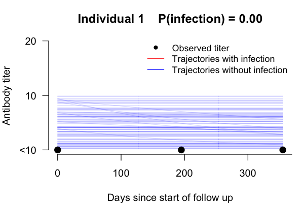
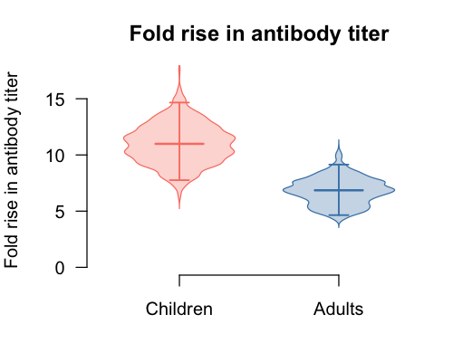
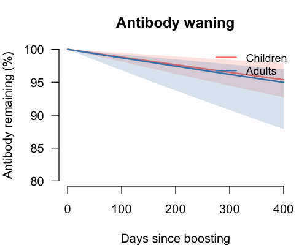
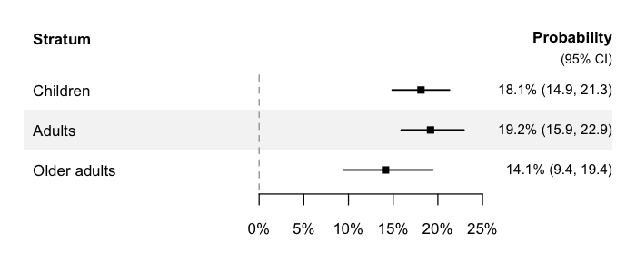

# seroreconstruct

[](https://github.com/timktsang/seroreconstruct/actions/workflows/R-CMD-check.yaml)
[](https://www.repostatus.org/#active)
[](https://www.gnu.org/licenses/gpl-2.0)

`seroreconstruct` is a Bayesian modeling framework to infer influenza
virus infection status, antibody dynamics, and individual infection
risks from serological data, by accounting for measurement error. This
could identify influenza infections by relaxing 4-fold rise rule, and
quantifies the contributions of age and pre-epidemic
hemagglutination-inhibiting (HAI) titers to infection risk.

## Features

- **Bayesian MCMC inference** of infection probability, antibody
  boosting/waning, and measurement error
- **Multi-season support** — fit season-specific infection risk and HAI
  protection parameters
- **Subgroup comparisons** via `group_by` — fit independent MCMCs for
  age groups, vaccination status, or other strata
- **Shared parameters** via `shared` — run a joint model that shares
  measurement error and/or boosting/waning across groups while
  estimating group-specific infection risk
- **S3 classes** with [`print()`](https://rdrr.io/r/base/print.html) and
  [`summary()`](https://rdrr.io/r/base/summary.html) methods for clean
  output
- **Publication-ready plots** — antibody trajectories, boosting/waning
  distributions, infection probability forest plots, MCMC diagnostics
- **Summary tables** — parameter estimates with credible intervals,
  per-individual infection probabilities
- **Subject ID tracking** — pass `subject_ids` to
  [`sero_reconstruct()`](https://timktsang.github.io/seroreconstruct/reference/sero_reconstruct.md)
  for ID-based individual lookup in plots
- **Simulation** — generate synthetic datasets for validation and power
  analysis

## Installation

``` r
# install.packages("devtools")
devtools::install_github("timktsang/seroreconstruct")
```

## Quick start

``` r
library(seroreconstruct)

# Load example data
data("inputdata")
data("flu_activity")

# Fit the model (use more iterations for real analyses, e.g. 200000)
fit <- sero_reconstruct(inputdata, flu_activity,
                        n_iteration = 2000, burnin = 1000, thinning = 1)

# View results
summary(fit)
```

## Visualization

### Antibody trajectory

``` r
plot_trajectory(fit, id = 1)
```



Red lines show posterior trajectories with infection; blue lines show
trajectories without infection. Black dots are observed HAI titers.

### Boosting distribution

``` r
plot_boosting(fit)
```



Violin plots of the posterior fold-rise in antibody titer after
infection, with median crossbar and 95% credible interval.

### Waning curves

``` r
plot_waning(fit)
```



Posterior median and 95% credible band for antibody remaining over time
since infection.

### Infection probability

``` r
plot_infection_prob(fit,
  labels = c("Children", "Adults", "Older adults"))
```



Forest plot of posterior infection probabilities. Supports combining
multiple fits with section headers for multi-group comparisons.

## Tables

``` r
# Parameter estimates with credible intervals
table_parameters(fit)

# Per-individual infection probabilities
table_infections(fit)
```

## Subgroup analysis

Fit separate models for each age group:

``` r
fit_by_age <- sero_reconstruct(inputdata, flu_activity,
                               n_iteration = 20000, burnin = 10000,
                               thinning = 5, group_by = ~age_group)

# View combined results
summary(fit_by_age)

# Access individual group fits
summary(fit_by_age[["1"]])
```

## Joint model with shared parameters

When comparing groups (e.g., vaccinated vs unvaccinated), some
parameters are biologically shared (measurement error, antibody
dynamics) while infection risk differs between groups. Use `shared` to
run a single joint MCMC that shares the specified parameters:

``` r
# Share measurement error and boosting/waning across vaccine groups
fit_joint <- sero_reconstruct(inputdata, flu_activity,
                              n_iteration = 20000, burnin = 10000,
                              thinning = 5,
                              group_by = ~vaccine,
                              shared = c("error", "boosting_waning"))

print(fit_joint)
```

Available shared parameter types:

| Value               | Parameters shared                   | Rationale                                        |
|---------------------|-------------------------------------|--------------------------------------------------|
| `"error"`           | Random + two-fold measurement error | Lab measurement property, same for all groups    |
| `"boosting_waning"` | Antibody boosting and waning rates  | Biological response, may be shared across groups |

Infection probability and HAI protection are always group-specific.

## Multi-season analysis

Add a `season` column (0-indexed integer) to your input data:

``` r
# Stack data from multiple seasons
inputdata$season <- 0L  # single season example

# For multi-season: combine data frames with season = 0, 1, 2, ...
# The model estimates season-specific infection risk and HAI protection
fit_multi <- sero_reconstruct(multi_season_data, flu_activity,
                              n_iteration = 20000, burnin = 10000,
                              thinning = 5)
```

## Simulation

Generate synthetic data for validation:

``` r
data("para1")  # example parameter vector (single season)
data("para2")  # baseline HAI titer distribution

simulated <- simulate_data(inputdata, flu_activity, para1, para2)
```

## Citation

To cite package **seroreconstruct** in publications use:

Tsang TK, Perera RAPM, Fang VJ, Wong JY, Shiu EY, So HC, Ip DKM, Malik
Peiris JS, Leung GM, Cowling BJ, Cauchemez S. (2022). Reconstructing
antibody dynamics to estimate the risk of influenza virus infection. Nat
Commun. 2022 Mar 23;13(1):1557.

## Development

Code development assisted by AI tools (Claude, Anthropic; Codex,
OpenAI).
